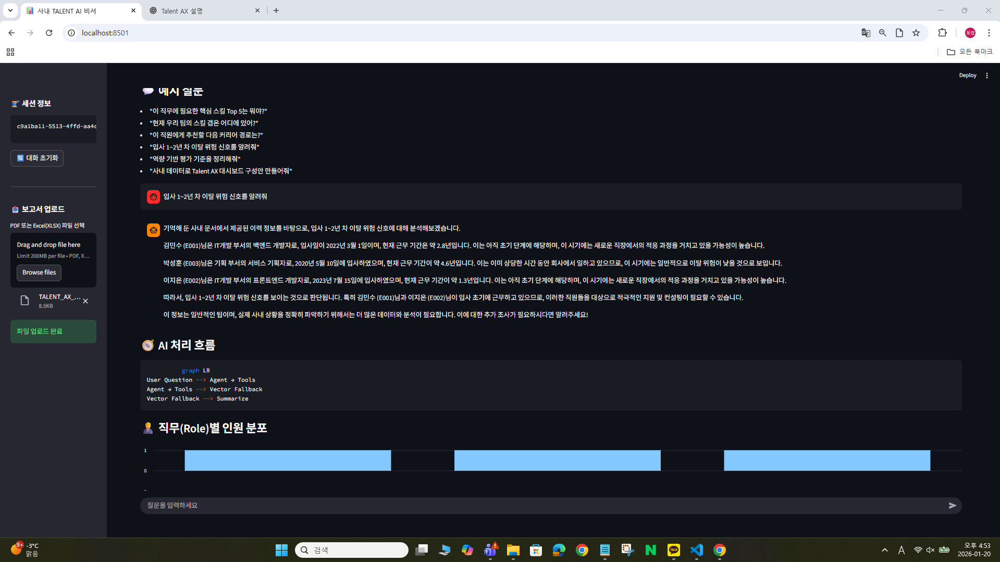

# TALENT

엑셀에 기입된 인사정보를 업로드하여 자체 백엔드처럼 활용해 **엑셀업로드 → LLM 기반 Q&A** 흐름을 실험하는 스터디용 프로젝트입니다

## 개발 배경  
- “엑셀로 기입된 인사정보를 사내 서비스처럼 쓰면 해당 인사정보를 AI를 통한 응답 흐름만 집중적으로 연습할 수 있다”는 아이디어.
- Python 기반 AI Agent 서비스의 구조와 스트리밍 Q&A 패턴을 연습하기 위한 스터디 목적.

## 기술 스택
- **언어/런타임**: Python 3.11  
- **데이터 소스**: 엑셀
- **UI**: LangGraph + Vector  
- **AI**: Ollama AI(무료)  

## 프로젝트 구조 및 역할
```
vector_store.py    vector Index 생성
main.py            검색 및 업로드 기능
streamlit_app.py   UI 
```

## 어플리케이션 아키텍처
```
[사용자 목표 입력(엑셀업로드)]
       ↓
[Agent Controller(main.py)]
 ─────────────┐
│ Tool 사용    │ →  백터 Index + LangGraph 
└─────────────┘
       ↓
     [Q&A]
       ↓
필요 시 다시 Planner로 루프

```

## 주요 기능
- 업로드 된 인사정보에 따라 UI에서 다양한 Q&A 
- 엑셀정보 Vector Index 생성
- Ollama 스트리밍 Q&A(키 없이 무료)

## 개발 이슈 및 배운 점
- 무료 AI라서 API의 response 반응시간이 오래걸림 최소(readout = 420) → 버전을 올리면 시간이 줄어들 수 있음  
- 버전을 올리려면 최소 RAM16GB 이상 필요 

## 확장 방향성
- 인사정보 그래프 고도화
- response 에 따른 시간 최소화
- 엑셀 sheet별로 청크 추가하기(현재 첫번쨰 sheet만 청크)
- 불필요한 소스 내용 정리 

stram UI는 `BACKEND`(Vector Index + LangGraph)와 엑셀 업로드 된 내용으로 다양한 시나리오를 실험할 수 있습니다.
"" 
